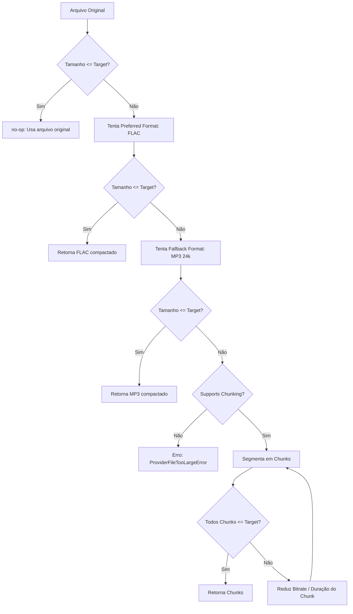

# Pipeline de Compressão e Segmentação de Áudio Robustecida

Este documento descreve a arquitetura, o fluxo de execução e a configuração do pipeline de compressão e chunking de áudio implementado no Meet Transcription para preparar arquivos de mídia antes do envio a provedores em nuvem.

---

## 1. Arquitetura do Pipeline

O pipeline foi projetado para ser altamente resiliente, priorizando o uso do utilitário de linha de comando `ffmpeg` (CLI) e suportando múltiplos wrappers e bibliotecas Python como fallbacks opcionais.



---

## 2. Ordem de Tentativas e Backends

O planejador em `app/audio/planner.py` decide a melhor estratégia e o backend de processamento a ser utilizado de forma determinística:

1.  **no-op**: Se o tamanho do arquivo original já estiver abaixo do limite (Target MB) do provedor, nenhuma compressão é realizada.
2.  **ffmpeg_cli**: Executável nativo padrão no sistema. É a dependência recomendada.
3.  **Wrappers opcionais**: Caso a CLI do `ffmpeg` não esteja instalada no sistema, o sistema tenta usar uma das seguintes bibliotecas Python instaladas:
    *   `ffmpeg-python`
    *   `pydub`
    *   `moviepy`
4.  **Falha amigável**: Se nenhum backend estiver disponível, lança-se a exceção `FfmpegNotFoundError` com mensagem apropriada.

---

## 3. Estratégias contra Loop Infinito (Multi-Pass)

Durante a segmentação (chunking), se um dos pedaços resultantes ainda ultrapassar o limite de tamanho do provedor:
1.  O sistema reduz o bitrate progressivamente (ex: de 24k para 16k e depois para 8k).
2.  Se ainda exceder, a duração do segmento é reduzida pela metade (ex: de 900s para 450s, 225s, etc., até o limite inferior seguro de 60s).
3.  Caso todas as combinações falhem, o sistema aborta a operação e lança um erro amigável, evitando loops infinitos e travamentos do worker.

---

## 4. Segurança e Path Traversal

*   **Bloqueio de Path Traversal**: Todas as saídas geradas pelos backends e pelo pipeline de compressão são estritamente validadas. Qualquer caminho resolvido de saída deve estar contido obrigatoriamente dentro do diretório temporário específico do job (`tmp/job_id`). Tentativas de subida de diretórios (como uso de `..`) são abortadas e geram erro de validação imediato.
*   **Segredos e Logs**: O sistema nunca grava segredos ou URLs assinadas de arquivos em nuvem no sistema de logs.

---

## 5. Padrão de Logs do Pipeline

Para fins de observabilidade, a preparação de áudio gera apenas um log simplificado no seguinte formato:

```text
Audio preparation: input_size_mb=300.00, output_size_mb=23.40, target_mb=25, backend=ffmpeg_cli, duration_seconds=1800.00
```

*   `input_size_mb`: Tamanho original do arquivo em megabytes.
*   `output_size_mb`: Tamanho final pós-compressão (ou soma dos tamanhos de todos os chunks gerados).
*   `target_mb`: Limite do provedor.
*   `backend`: Backend utilizado (`no-op`, `ffmpeg_cli`, `ffmpeg_python`, `pydub` ou `moviepy`).
*   `duration_seconds`: Duração total do áudio em segundos.

---

## 6. Solução de Problemas (Troubleshooting)

### Erro: *"O executável ffmpeg não foi encontrado no sistema"*
*   **Causa**: Nem a ferramenta `ffmpeg` CLI nem nenhuma das bibliotecas Python opcionais (`pydub`, `moviepy`, `ffmpeg-python`) estão instaladas ou acessíveis pelo sistema.
*   **Ação**: Instale o `ffmpeg` no sistema hospedeiro ou configure o container Docker utilizando as tags de compilação corretas (ex: `INSTALL_LOCAL_TRANSCRIPTION=true` no Dockerfile).
